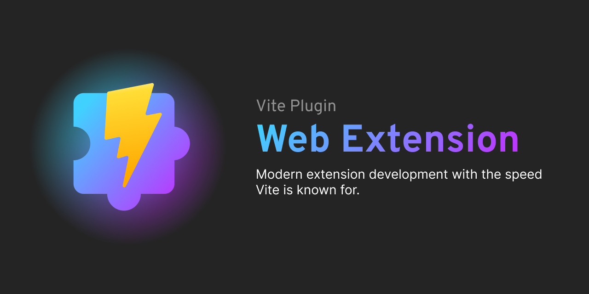

To get started quickly, bootstrap a new project!

```bash
pnpm create vite-plugin-web-extension
npm create vite-plugin-web-extension
yarn create vite-plugin-web-extension
```

Or install it as a dependency and add it to your `vite.config.ts`.

```bash
pnpm i -D vite-plugin-web-extension
```

```ts
// vite.config.ts
import webExtension from "vite-plugin-web-extension";

export default defineConfig({
  plugins: [webExtension()],
});
```

## Features

- :wrench: Automatically build inputs listed in your `manifest.json`
- :tada: Open a browser and install the extension during development
- :zap: Super fast dev mode
- :globe_with_meridians: Supports all browsers
- :fire: Full frontend framework support (popup, options, and content scripts)
- :robot: Typescript support out of the box!
- :white_check_mark: Manifest validation

## Documentation

To get started, checkout the docs:

<https://vite-plugin-web-extension.aklinker1.io>

## Contributing

Special thanks to the contributors!

<a href="https://github.com/aklinker1/vite-plugin-web-extension/graphs/contributors">
  
</a>

See the [contributing docs](CONTRIBUTING.md) to setup the project for development.
